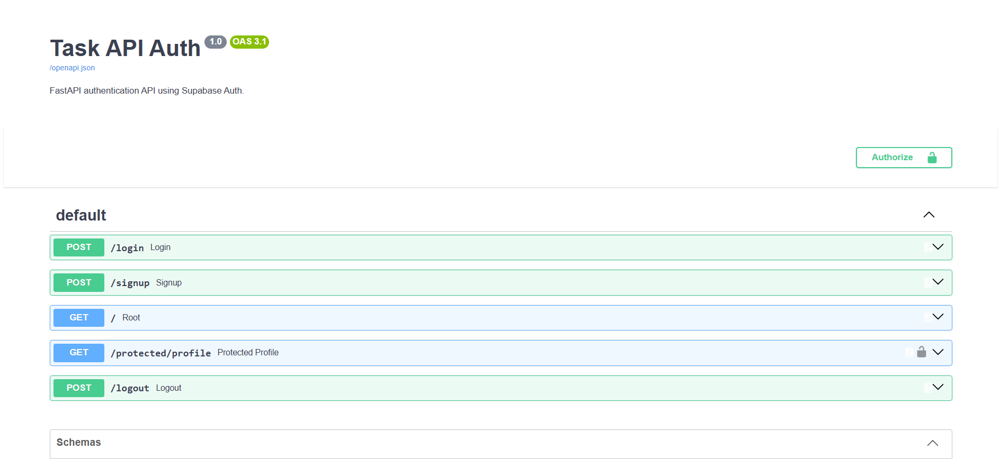

\# Auth API — FastAPI + Supabase


A secure authentication API built with \*\*FastAPI\*\* and \*\*Supabase Auth\*\* for the FlyRank Backend Internship — Week 2 Assignment A4.


The API supports user signup, login, logout, JWT verification, protected routes, and Swagger UI bearer authentication.


\## Features


\- User signup with Supabase Auth

\- User login with email and password

\- JWT access-token authentication

\- Protected routes

\- Reusable authentication dependency

\- Logout

\- Swagger UI with Bearer authentication

\- Environment variables for Supabase credentials

\- Automatic API documentation


\## Technologies


\- Python 3.14

\- FastAPI

\- Supabase Auth

\- PyJWT

\- Pydantic

\- Uvicorn


\## Project Structure


```text

task-api-auth/

│── main.py

│── requirements.txt

│── README.md

│── .env.example

│── .gitignore

└── venv/


Setup

1\. Clone the repository

git clone <your-github-repository-url>

cd task-api-auth

2\. Create a virtual environment

python -m venv venv

3\. Activate the virtual environment

Windows PowerShell

.\\venv\\Scripts\\Activate.ps1

4\. Install dependencies

pip install -r requirements.txt

5\. Configure environment variables


Create a .env file in the project root:


SUPABASE\_URL=https://your-project.supabase.co

SUPABASE\_KEY=your-supabase-anon-key


Replace the placeholder values with your Supabase project credentials.


Never commit the .env file to GitHub.


6\. Run the application

uvicorn main:app --reload


The API will be available at:


http://127.0.0.1:8000


Swagger UI:


http://127.0.0.1:8000/docs

API Endpoints

Method	Endpoint	Authentication	Description

GET	/	No	API health/status

POST	/signup	No	Create a new user

POST	/login	No	Authenticate user and return JWT

POST	/logout	No	Log out the current Supabase session

GET	/protected/profile	Bearer JWT	Return authenticated user's profile

Authentication Flow

Create an account using POST /signup.

Confirm your email if email confirmation is enabled in Supabase.

Login using POST /login.

Copy the returned access\_token.

Open Swagger UI at /docs.

Click Authorize.

Enter the Bearer token.

Call GET /protected/profile.


Example authorization header:


Authorization: Bearer <access\_token>

Protected Route


The /protected/profile endpoint requires a valid Supabase JWT.


Without a valid token:


401 Unauthorized


With a valid token, the API returns the authenticated user's information.


Example response:


{

&#x20; "message": "You have access to this protected route",

&#x20; "user\_id": "user-id",

&#x20; "email": "user@example.com"

}

Environment Variables


Create .env locally using:


SUPABASE\_URL=your-supabase-project-url

SUPABASE\_KEY=your-supabase-anon-key


A safe template is provided in .env.example.


Swagger Documentation


The API includes automatically generated Swagger documentation with Bearer authentication support.


Open:


http://127.0.0.1:8000/docs


## Swagger Documentation



Security

Supabase Auth manages user accounts and passwords.

JWTs are issued by Supabase.

Protected routes verify the supplied JWT.

Supabase credentials are loaded through environment variables.

.env is excluded from Git using .gitignore.

No passwords or secret keys are stored directly in the source code.


Author


Areena Dilawar

